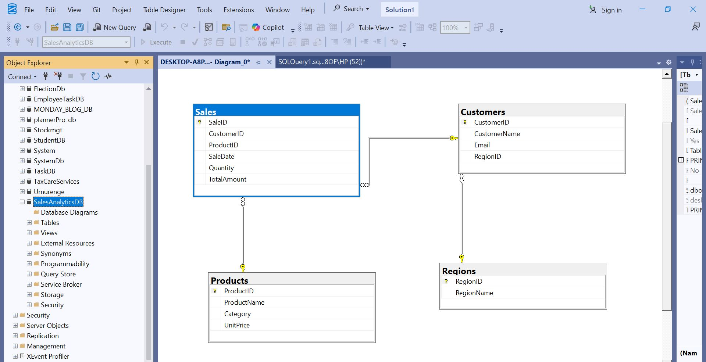
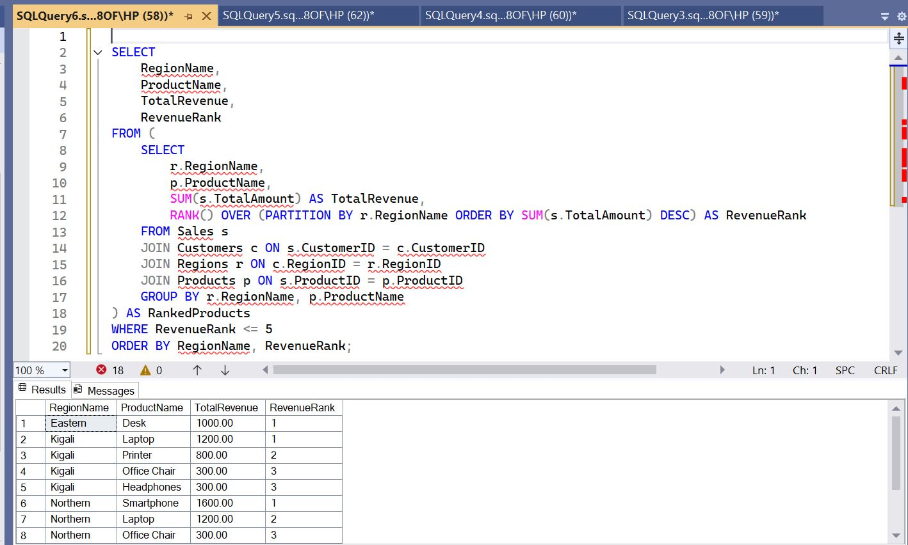

# Retail Sales Performance Analytics System

## Business Context
A retail company operating in multiple regions sells various products to customers.  
The Sales and Marketing department wants to analyze performance using transactional data.

## Data Challenge
Management lacks detailed insights into:
- Top-performing products  
- High-value customers  
- Monthly sales trends  

They also cannot easily:
- Compare regional performance  
- Track growth over time  

## Expected Outcome
The company wants to:
- Identify top products per region  
- Segment customers based on spending behavior  
- Analyze sales growth trends  
- Support strategic marketing and inventory decisions  

---

## Ranking

**Goal:** Identify the Top 5 products per region based on total sales revenue.

**Window Function Used:**  
- `RANK()` or `DENSE_RANK()`

**Why this is good:**
- Shows performance comparison  
- Works perfectly with `PARTITION BY region`  
- Measurable  

---

## Running Totals

**Goal:** Calculate cumulative monthly sales revenue to analyze growth trends over time.

**Window Function Used:**  
- `SUM() OVER (ORDER BY Month ROWS BETWEEN ...)`

**Why this is good:**
- Shows trend  
- Uses required aggregate window function  
- Easy to interpret  

---

## Month-over-Month Growth

**Goal:** Compare each month’s sales with the previous month to measure growth or decline.

**Window Function Used:**  
- `LAG()`

**Why this is good:**
- Required navigation function  
- Helps detect increase or decrease  
- Very analytical  

---

## Customer Segmentation

**Goal:** Segment customers into four spending groups (quartiles) based on total purchase value.

**Window Function Used:**  
- `NTILE(4)`

**Why this is good:**
- Required distribution function  
- Business-oriented  
- Strong analysis point  

---

## Moving Average

**Goal:** Compute a 3-month moving average of sales to smooth short-term fluctuations.

**Window Function Used:**  
- `AVG() OVER (ROWS BETWEEN 2 PRECEDING AND CURRENT ROW)`
  

